# 👋 Hi, there. I’m Kain

I’m a senior software engineer (Full Stack), engaged in the hotel industry, and an open source enthusiast.

~ Love coding, hobby is still coding, exploring distributed, open source

Currently focusing on cloud-native Kubernetes, the technology stack is mainly Angular, Golang, NoSQL, Nats

Looking into the practical use of DevOps and LowCode, looking for a breakthrough

[Weplanx](https://github.com/weplanx) an open source project I am working on 

