# 👋 Hi, there. I’m Kain

I’m a senior software engineer (Full Stack), engaged in the hotel industry, and an open source enthusiast.

~ Love coding, hobby is still coding, exploring distributed, open source

Currently focusing on cloud-native Kubernetes, ~~Docker~~, the technology stack is mainly Golang, NoSQL, Nats, ~~PHP, Node, RabbitMQ~~, MySQL

Looking into the practical use of DevOps and LowCode, a bit lost -> looking for a breakthrough

This is the project I am working on -> [Weplanx](https://github.com/weplanx)

